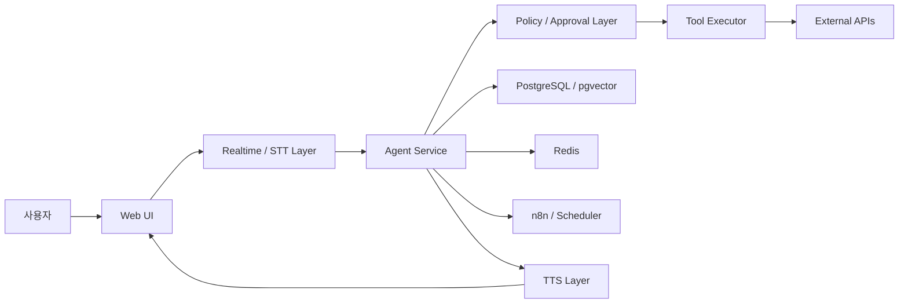

# System Architecture
#voice-ai #agent #architecture #mvp #security #automation

## 목적
음성 기반 AI 비서의 전체 시스템 구조를 정의한다.

## 핵심 요약
- 가장 현실적인 구조는 `웹 프론트엔드 + Python API 서버 + 승인형 tool executor + PostgreSQL/Redis`다.
- 핵심 흐름은 `음성 입력 -> STT/Realtime -> Agent -> Approval -> Tool Execution -> Result -> TTS`다.
- 초기에는 단순 function calling, 이후에는 LangGraph/n8n을 결합한 구조가 적합하다.

## 상세 내용
### 권장 시스템 계층
- `Conversation Layer`: 음성 입력, 실시간 세션, turn/VAD 관리
- `Agent Layer`: 의도 파악, 슬롯 추출, 추가 질문, 도구 선택
- `Workflow Layer`: 승인, 재시도, 중단/재개, 상태 저장
- `Tool Layer`: 이메일, 뉴스, 주식, GitHub, 캘린더, 파일, 검색
- `Persistence Layer`: 세션, 로그, 메모리, 캐시

### 전체 흐름
```text
Mic/Web UI
-> STT or Realtime Session
-> Intent / Slot Extraction
-> Tool Planning
-> Approval Gate
-> Tool Execution
-> Result Summarization
-> TTS
-> User
```

### 구성도


### 권장 저장소 구성
| 저장소 | 용도 |
|---|---|
| PostgreSQL | 사용자, 실행 로그, 승인 이력, 설정 |
| Redis | 세션, 큐, short-term memory, rate limit |
| pgvector | 임베딩 기반 장기 메모리 |
| Object Storage | 음성 파일, 첨부파일, 문서 원본 |

### 아키텍처 원칙
- 쓰기 액션은 approval gate를 반드시 거친다.
- 음성 세션과 실제 실행 권한을 분리한다.
- 도구는 read/write/admin으로 권한 분리한다.
- 모든 실행은 trace 가능한 로그를 남긴다.

## 관련 문서
- [[Voice_Pipeline]]
- [[Tool_Execution_Model]]
- [[Security_Model]]
- [[Approval_System]]
- [[Tech_Stack_Decision]]
- [[MVP_Definition]]

## 참고 자료
- [[References]]
> [!warning] Deprecated  
> Superseded by: [[Platform_Architecture]]
