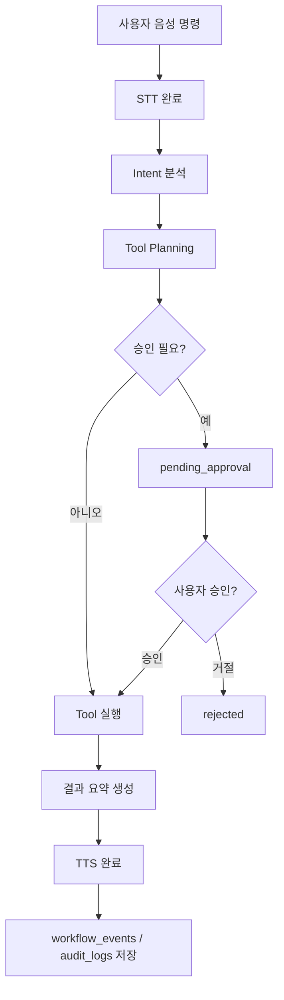
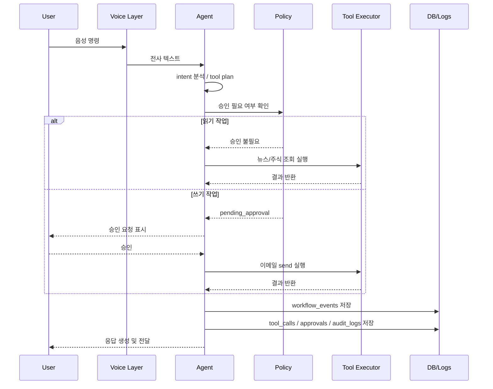

# Agent Workflow
#voice-ai #agent #architecture #mvp #security #automation

## 목적
JARVIS 에이전트가 사용자 요청을 받아 처리하고 기록하는 전체 흐름을 시각적으로 설명한다.

## 핵심 요약
- JARVIS의 기본 흐름은 `음성 명령 → STT → intent 분석 → tool planning → 승인 판단 → 실행 → 응답 → 로그 저장`이다.
- 읽기 작업은 승인 없이 빠르게 완료될 수 있지만, 쓰기 작업은 `pending_approval` 단계를 거친다.
- workflow는 `workflow_events`, `tool_calls`, `approvals`, `audit_logs`, `email_drafts`, `voice_sessions`, `conversations`를 기반으로 복원한다.

## 상세 내용
### 전체 처리 흐름
1. 사용자가 음성 명령을 말한다.
2. STT 또는 Realtime transcription이 텍스트를 생성한다.
3. Agent가 intent와 슬롯을 파싱한다.
4. Tool planner가 필요한 도구 호출 계획을 생성한다.
5. Policy engine이 읽기/쓰기/고위험 작업 여부를 판단한다.
6. 승인 필요 시 `pending_approval`로 전환한다.
7. 승인되면 tool executor가 실제 작업을 수행한다.
8. 결과를 assistant response로 정리한다.
9. TTS 응답을 생성한다.
10. 모든 단계는 workflow event와 로그로 저장된다.

### 읽기 작업과 쓰기 작업의 분기
- 읽기 작업:
  - 뉴스 조회
  - 주식 조회
  - 문서 요약
- 쓰기 작업:
  - 이메일 발송
  - 일정 생성
  - 파일 수정

읽기 작업은 `planned -> executing -> completed` 경로를 따를 수 있지만, 쓰기 작업은 `planned -> pending_approval -> approved -> executing -> completed` 경로를 따른다.

### Mermaid graph TD


### Mermaid sequenceDiagram


### 이메일 draft/send 예시
```text
사용자: "김철수에게 내일 회의 연기 메일 써줘"
-> stt_completed
-> intent_parsed(email_draft)
-> tool_plan_created(email_draft)
-> tool_execution_completed(draft_created)
-> approval_requested(email_send)
-> approval_approved
-> tool_execution_started(email_send)
-> tool_execution_completed(sent)
-> assistant_response_created
-> tts_completed
```

### 뉴스/주식 조회 예시
```text
사용자: "오늘 개발 뉴스 요약해줘"
-> stt_completed
-> intent_parsed(news_scrum)
-> tool_plan_created(news_scrum)
-> tool_execution_started
-> tool_execution_completed
-> assistant_response_created
-> tts_completed
```

## 관련 문서
- [[PRD]]
- [[System_Prompt]]
- [[API_Spec]]
- [[Database_Schema]]
- [[Approval_System]]
- [[Tool_Execution_Model]]
- [[Security_Model]]
- [[Task_State_Model]]
- [[Workflow_Log_Format]]
- [[Workflow_API_Design]]

## 참고 자료
- [[References]]
> [!warning] Deprecated  
> Superseded by: [[Execution_Flows]]
