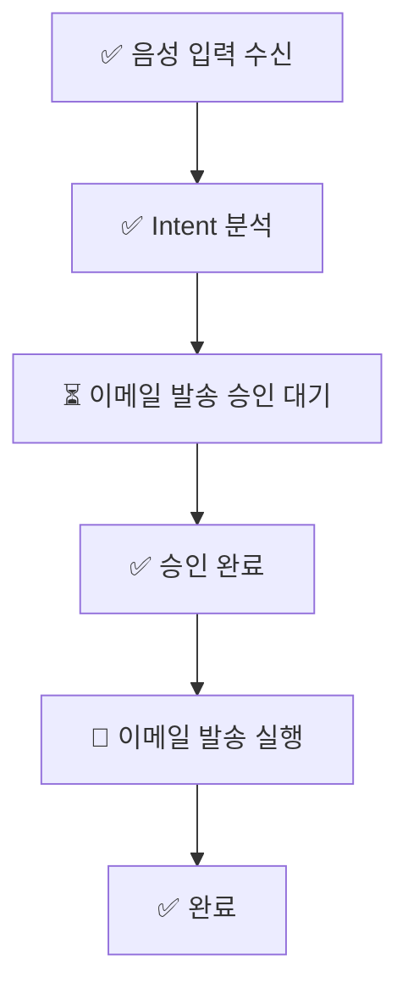

# Mermaid Generation Strategy
#voice-ai #agent #architecture #mvp #security #automation

## 목적
DB와 로그 데이터를 Mermaid 다이어그램으로 변환하는 전략을 정의한다.

## 핵심 요약
- 하나의 session workflow는 `graph TD`, `sequenceDiagram`, `stateDiagram-v2` 세 가지 관점으로 표현할 수 있다.
- `workflow_events`와 `tool_calls`, `approvals`를 조합해 Mermaid 문자열을 생성한다.
- 상태별 아이콘 규칙을 부여해 Obsidian과 GitHub README에서 사람이 빠르게 이해할 수 있게 한다.

## 상세 내용
### Mermaid graph TD 생성 전략
- 목적: 전체 작업 구조를 노드/엣지로 한눈에 보여주기
- 입력: `workflow_events`
- 규칙:
  - 각 event를 node로 변환
  - `parent_node_id`를 edge로 변환
  - label에는 event 요약 + 상태 아이콘을 포함

### sequenceDiagram 생성 전략
- 목적: 사용자, 음성 레이어, agent, policy, tool executor, DB 간 상호작용 표시
- 입력: `conversations`, `workflow_events`, `approvals`
- 규칙:
  - actor를 고정 participant로 둠
  - event_type에 따라 메시지 방향을 템플릿 매핑

### stateDiagram-v2 생성 전략
- 목적: 하나의 task가 어떤 상태를 거쳤는지 표현
- 입력: `tool_calls.status`, `approvals.decision`, `workflow_events.status`
- 규칙:
  - 상태 전이만 표현
  - 여러 task를 한 diagram에 합치지 않고 task 단위로 생성 가능

### node naming 규칙
- `n_recv_001`
- `n_parse_001`
- `n_plan_001`
- `n_approve_001`
- `n_exec_001`
- `n_done_001`

권장 형식:
```text
<prefix>_<event-or-stage>_<sequence>
```

### status별 아이콘 규칙
- completed: ✅
- pending_approval: ⏳
- failed: ❌
- executing: 🔄
- rejected: 🚫

예시 label:
```text
✅ Intent 분석 완료
⏳ 이메일 발송 승인 대기
🔄 주식 브리핑 실행 중
❌ 이메일 발송 실패
🚫 사용자 거절
```

### Mermaid 코드 생성 예시


### Python generator 예시
```python
def status_icon(status: str) -> str:
    return {
        "completed": "✅",
        "pending_approval": "⏳",
        "failed": "❌",
        "executing": "🔄",
        "rejected": "🚫",
    }.get(status, "")


def build_mermaid(nodes, edges) -> str:
    lines = ["graph TD"]
    for node in nodes:
        icon = status_icon(node["status"])
        label = f'{icon} {node["label"]}'.strip()
        lines.append(f'    {node["id"]}["{label}"]')
    for edge in edges:
        lines.append(f'    {edge["from"]} --> {edge["to"]}')
    return "\n".join(lines)
```

### FastAPI에서 Mermaid 문자열 반환 예시
```python
from fastapi import APIRouter

router = APIRouter()

@router.get("/workflow/{session_id}/mermaid")
def get_workflow_mermaid(session_id: str):
    nodes = [
        {"id": "n1", "label": "음성 입력 수신", "status": "completed"},
        {"id": "n2", "label": "Intent 분석", "status": "completed"},
    ]
    edges = [{"from": "n1", "to": "n2"}]
    mermaid = build_mermaid(nodes, edges)
    return {"session_id": session_id, "diagram_type": "graph_td", "mermaid": mermaid}
```

### Obsidian에서 보는 방법
- Markdown 코드블록에 `mermaid` 지정
- 문서 안에 직접 Mermaid 문자열 삽입
- workflow snapshot을 정적 문서로 저장 가능

### GitHub README에서 보는 방법
- GitHub는 Mermaid 렌더링을 지원하므로 fenced code block 사용
- 장문의 타임라인은 collapse 또는 별도 문서 링크 권장

## 관련 문서
- [[Agent_Workflow]]
- [[Task_State_Model]]
- [[Workflow_Log_Format]]
- [[Workflow_API_Design]]

## 참고 자료
- [[References]]
> [!warning] Deprecated  
> Superseded by: [[Execution_Flows]]
