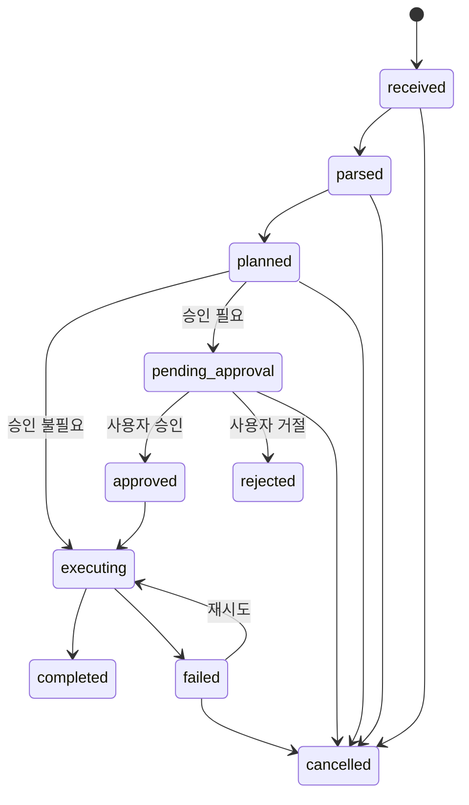

# Task State Model
#voice-ai #agent #architecture #mvp #security #automation

## 목적
에이전트 작업 상태를 일관되게 정의하고, 읽기/쓰기/실패/재시도 흐름을 추적할 수 있도록 상태 모델을 설계한다.

## 핵심 요약
- 모든 작업은 공통 상태 머신을 가진다.
- 핵심 상태는 `received`, `parsed`, `planned`, `pending_approval`, `approved`, `executing`, `completed`, `rejected`, `failed`, `cancelled`다.
- `tool_calls.status`는 실행 상태를, `approvals.decision`은 승인 결정을 나타내며 둘의 관계를 분리해 설계해야 한다.

## 상세 내용
### 상태 정의
| 상태 | 의미 |
|---|---|
| received | 사용자 입력 수신 완료 |
| parsed | intent/slot 분석 완료 |
| planned | tool 계획 생성 완료 |
| pending_approval | 승인 대기 |
| approved | 승인 완료 |
| executing | 실제 도구 실행 중 |
| completed | 성공 완료 |
| rejected | 사용자 또는 정책에 의해 거절 |
| failed | 실행 실패 |
| cancelled | 사용자 취소 또는 세션 종료로 중단 |

### 상태 전이표
| 현재 상태 | 다음 상태 | 조건 |
|---|---|---|
| received | parsed | STT 또는 입력 파싱 성공 |
| parsed | planned | tool plan 생성 성공 |
| planned | executing | 읽기 작업 또는 승인 불필요 |
| planned | pending_approval | 승인 필요 작업 |
| pending_approval | approved | 사용자 승인 |
| pending_approval | rejected | 사용자 거절 |
| approved | executing | executor 시작 |
| executing | completed | 성공 |
| executing | failed | 실행 오류 |
| failed | executing | 재시도 |
| any | cancelled | 사용자 취소 또는 세션 중단 |

### 읽기 작업 상태 흐름
```text
received -> parsed -> planned -> executing -> completed
```

### 쓰기 작업 상태 흐름
```text
received -> parsed -> planned -> pending_approval -> approved -> executing -> completed
```

### 실패/재시도 흐름
```text
executing -> failed -> executing -> completed
```

### 승인 거절 흐름
```text
planned -> pending_approval -> rejected
```

### `tool_calls.status`와 `approvals.decision`의 관계
| 상황 | tool_calls.status | approvals.decision |
|---|---|---|
| 읽기 작업 완료 | completed | null |
| 승인 대기 이메일 | pending_approval | pending |
| 승인 완료, 실행 전 | pending_approval 또는 approved-mapped | approved |
| 승인 거절 | rejected | rejected |
| 발송 실패 | failed | approved |

권장 원칙:
- `tool_calls.status`는 시스템 실행 상태
- `approvals.decision`은 사람의 결정 상태
- 둘을 하나의 컬럼으로 합치지 않는다

### Mermaid stateDiagram-v2


## 관련 문서
- [[Database_Schema]]
- [[Approval_System]]
- [[Tool_Execution_Model]]
- [[Security_Model]]
- [[Workflow_Log_Format]]
- [[Agent_Workflow]]

## 참고 자료
- [[References]]
> [!warning] Deprecated  
> Superseded by: [[Agent_Runtime]]
