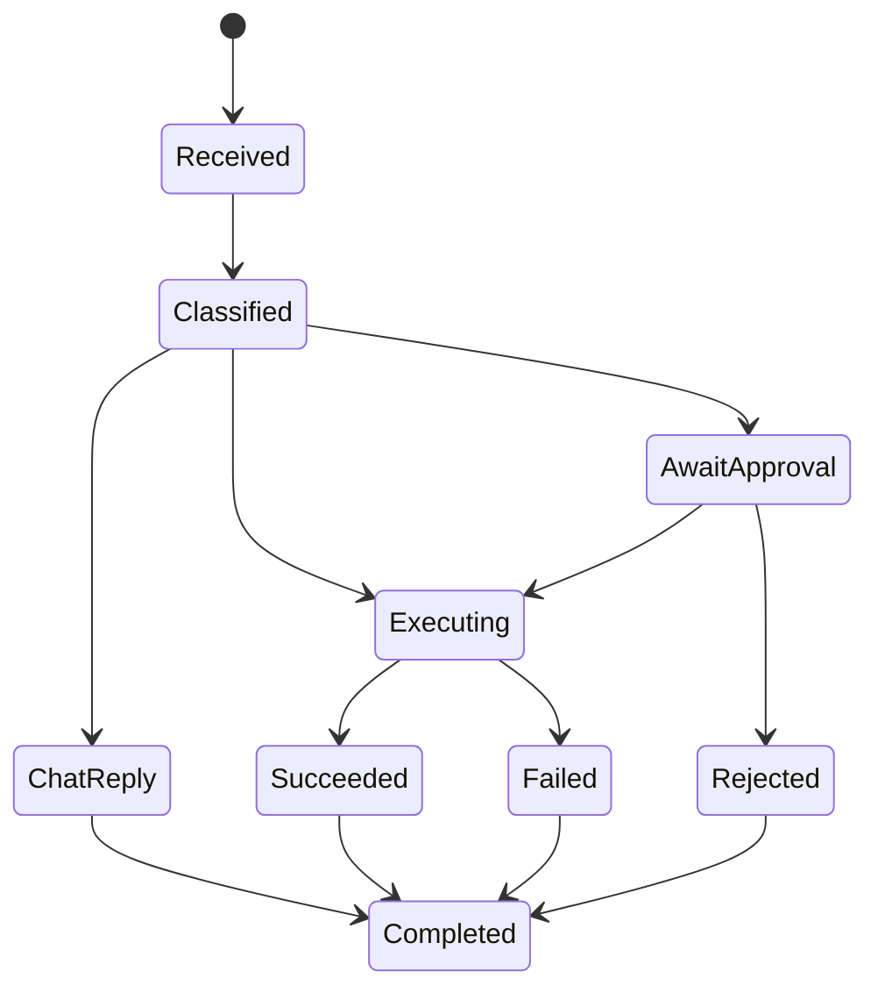

> Legacy note: This document is preserved for historical context. The active direction is [[JARVIS_Voice_Layer_Strategy]].

# Agent Runtime
#agent #planning #routing #state

## Purpose
Define the control-plane logic that turns user intent into either a conversational answer or an executable plan.

## Responsibilities
- Normalize input from text, voice, and selected workspace context
- Decide whether the turn is `chat`, `tool`, or `code_execution`
- Route inference to local or cloud models
- Perform policy checks before execution
- Maintain execution state and event log
- Summarize tool and interpreter results back into user-facing responses

## Internal Modules
- Planner
  - decomposes requests into steps
- Policy Engine
  - assigns risk scores and approval requirements
- Model Router
  - chooses Ollama or OpenAI
- Execution Coordinator
  - delegates to Open Interpreter or MCP
- Event Emitter
  - persists structured lifecycle records

## Agent State Machine


## Agent Result Envelope
```json
{
  "mode": "tool",
  "risk_level": "medium",
  "requires_approval": true,
  "plan": [
    {
      "step_id": "step_open_log",
      "kind": "tool",
      "tool": "filesystem.read_text",
      "arguments": {
        "path": "/workspace/logs/app.log"
      }
    }
  ],
  "final_response": "濡쒓렇 ?뚯씪??遺꾩꽍?섍린 ?꾪빐 ?댁슜???쎄퀬 ?ㅻ쪟 ?⑦꽩??異붿텧?섍쿋?듬땲??"
}
```

## Interaction Points
- Architecture context: [[Platform_Architecture]]
- Model routing detail: [[Model_Routing_Logic]]
- Interpreter integration: [[Open_Interpreter_Runtime]]
- MCP integration: [[Tool_Invocation_Model]]
- Security boundary: [[Permission_and_Approval_Model]]
