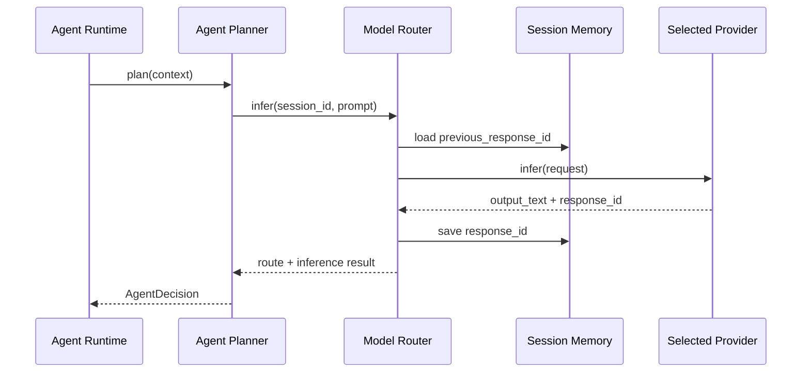

> Legacy note: This document is preserved for historical context. The active direction is [[JARVIS_Voice_Layer_Strategy]].

# Model Router Design
#agent #router #providers #lmstudio #ollama #openai

## Purpose
Document the code-level design of the model router and provider abstraction.

Related:
- [[Model_Routing_Architecture]]
- [[Model_Routing_Logic]]
- [[Agent_Runtime]]
- [[ADR_Model_Provider_Strategy]]

## Responsibility Boundary
The model router is the only component allowed to talk to model providers.

It owns:
- provider registration
- route selection
- fallback order
- stateful response handoff
- session memory for provider state IDs

It does not own:
- filesystem access
- approval policy
- tool execution
- Docker lifecycle

## Code Shape
- `/agent/model_router.py`
- `/agent/providers/lmstudio_provider.py`
- `/agent/providers/ollama_provider.py`
- `/agent/providers/openai_provider.py`
- `/agent/session_memory.py`

## Provider Contract
Every provider implements:
- `available()`
- `infer(request)`
- optional `infer_stream(request)`

## Runtime Sequence

## LM Studio Design Note
- Fact: LM Studio can handle stateful reasoning with `/v1/responses`.
- Assumption: JARVIS should use LM Studio first for multi-step planning because this keeps more reasoning local while preserving conversation state.

## Ollama Design Note
- Fact: Ollama is a fast local inference engine.
- Assumption: JARVIS should prefer it for short, stateless work where low latency matters more than memory continuity.

## OpenAI Design Note
- Fact: OpenAI exposes `/v1/responses`.
- Assumption: Keeping OpenAI behind the same provider interface preserves swappability and avoids cloud-specific code in business logic.
