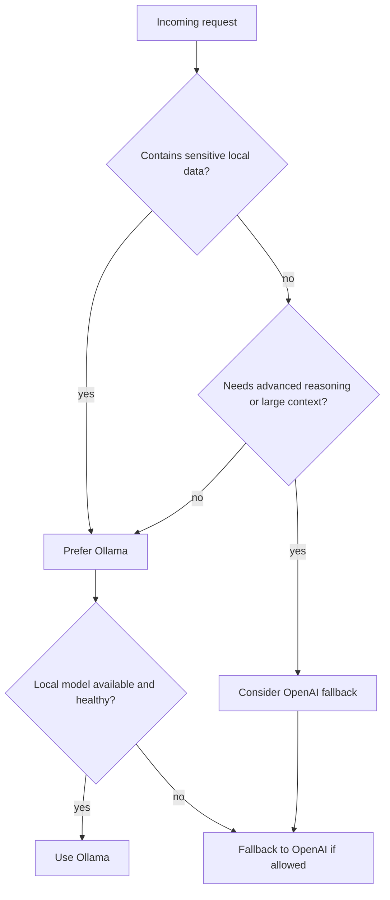

> Legacy note: This document is preserved for historical context. The active direction is [[JARVIS_Voice_Layer_Strategy]].

# Model Routing Logic
#agent #models #ollama #openai

Implementation-detail companions:
- [[Model_Routing_Architecture]]
- [[Model_Router_Design]]
- [[ADR_Model_Provider_Strategy]]

## Purpose
Define when JARVIS uses a local Ollama model, when it escalates to OpenAI, and how fallback should work.

## Default Rule
Local-first is the default. If a request can be handled with acceptable quality and latency on the local machine, the local provider wins.

## Routing Factors
- Privacy sensitivity
- Required reasoning depth
- Token/context size
- Tool-calling reliability
- Latency budget
- Cost budget
- User override

## Routing Table
| Scenario | Default Provider | Rationale |
|---|---|---|
| Local file analysis | Ollama | private data stays local |
| Build log summarization | Ollama | high privacy, tolerable speed |
| Multi-step code synthesis with weak local model | OpenAI | higher planning reliability |
| Public web summarization via MCP results | Ollama | external data already fetched |
| Ambiguous failure recovery | OpenAI fallback | better reasoning under uncertainty |

## Decision Logic

## Ollama Capabilities Used
Official Ollama chat API supports:
- chat messages
- tool definitions
- JSON or JSON-schema output formatting
This is documented in the Ollama chat endpoint docs. [Ollama chat docs](https://docs.ollama.com/api/chat)

## OpenAI Fallback Policy
- Disabled by default in high-privacy mode
- Enabled only when the user allows cloud inference or policy explicitly permits escalation
- Requests should be redacted before cloud escalation when possible

## Failure Policy
- If Ollama is unavailable, do not silently fall back to OpenAI unless policy allows it
- Surface provider choice in the execution log

## Interaction Points
- Agent control: [[Agent_Runtime]]
- Tool execution: [[Tool_Invocation_Model]]
- Security constraints: [[Security_Model]]
- Decision record: [[ADR_002_Model_Routing]]
