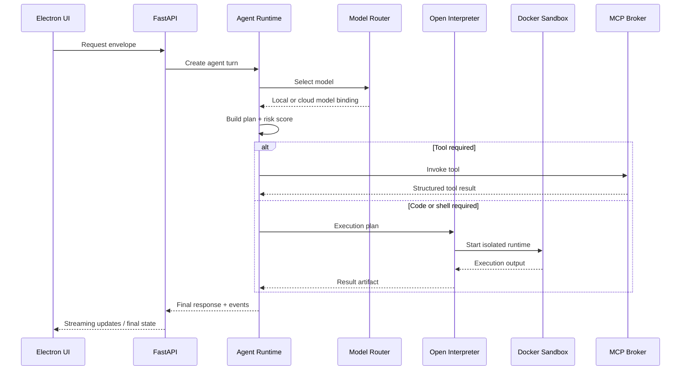

> Legacy note: This document is preserved for historical context. The active direction is [[JARVIS_Voice_Layer_Strategy]].

# Layered Runtime and Data Flow
#architecture #dataflow #desktop #backend #agent

## Purpose
Describe the exact runtime boundaries and object flow between the UI, API, agent, interpreter, and tools.

## Layer Responsibilities
### Desktop Experience Layer
- Hosts conversation UI, activity log, approval prompts, tool output, workspace context
- Maintains ephemeral UI state only
- Sends user intent to FastAPI via IPC and HTTP

### API Orchestration Layer
- Accepts requests from the desktop app
- Creates execution sessions, stores audit events, exposes status APIs
- Owns authentication for optional cloud services and local policy evaluation

### Agent Control Layer
- Normalizes user requests
- Chooses `chat`, `tool`, or `code-execution` mode
- Performs risk classification and permission checks
- Builds execution plans and interprets tool outputs

### Execution Runtime Layer
- Open Interpreter handles code and shell oriented actions
- Host action gate handles trusted native actions such as opening files or focusing apps
- Docker provides isolated execution for generated code or risky build/test flows

### Tool Layer
- MCP tool broker resolves tool name to transport, schema, and execution adapter
- Tools can be local or remote
- Tool results are always normalized to a typed result envelope

## Canonical Request Envelope
```json
{
  "session_id": "sess_01JARVIS",
  "request_id": "req_01JARVIS",
  "user_input": {
    "mode": "text",
    "content": "Analyze this log file"
  },
  "workspace": {
    "cwd": "/Users/alex/project",
    "selected_files": [
      "/Users/alex/project/logs/app.log"
    ]
  },
  "policy_context": {
    "approval_mode": "ask",
    "network_access": "restricted"
  }
}
```

## Runtime Flow


## Interaction Points
- Related architecture: [[Platform_Architecture]]
- Agent internals: [[Agent_Runtime]]
- Execution specifics: [[Open_Interpreter_Runtime]]
- Tool specifics: [[Tool_Invocation_Model]]
- Security implications: [[Security_Model]]
