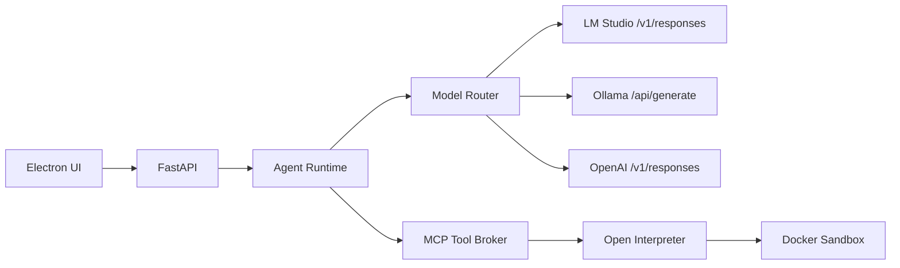

> Legacy note: This document is preserved for historical context. The active direction is [[JARVIS_Voice_Layer_Strategy]].

# Model Routing Architecture
#model-routing #lmstudio #ollama #openai #agent-platform

## Purpose
Define how JARVIS routes inference across LM Studio, Ollama, and OpenAI without coupling the agent runtime to a single provider.

Related:
- [[Platform_Architecture]]
- [[Layered_Runtime_and_Data_Flow]]
- [[Model_Router_Design]]
- [[ADR_Model_Provider_Strategy]]

## Facts From The Research Report
- Fact: LM Studio provides OpenAI-compatible endpoints, including `/v1/responses`.
- Fact: LM Studio supports stateful execution via `previous_response_id`.
- Fact: LM Studio supports SSE-style streaming events.
- Fact: Ollama is better suited for fast stateless local inference.
- Fact: OpenAI remains the cloud fallback path.

## Assumptions Added For JARVIS
- Assumption: LM Studio should be the primary local reasoning provider for multi-step planning.
- Assumption: Ollama should serve low-latency stateless tasks.
- Assumption: OpenAI should remain optional and policy-gated.

## Placement In The Runtime

## Routing Rules
- Use LM Studio for multi-step reasoning and stateful conversations.
- Use Ollama for simple tasks and fast local responses.
- Use OpenAI when local providers fail or higher reasoning accuracy is required.

## Stateful Memory Strategy
- Fact: LM Studio supports `previous_response_id`.
- Assumption: JARVIS persists provider-specific response IDs per session in runtime state files so the agent does not need to resend full history on every turn.

## Failure Order
- Complex reasoning: `LM Studio -> Ollama -> OpenAI`
- Simple tasks: `Ollama -> LM Studio -> OpenAI`
- Total failure: deterministic bootstrap planner
