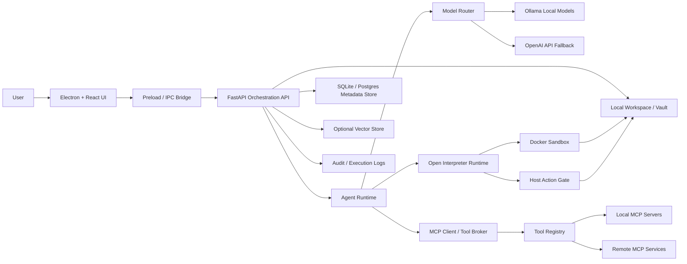

> Legacy note: This document is preserved for historical context. The active direction is [[JARVIS_Voice_Layer_Strategy]].

# Platform Architecture
#architecture #electron #fastapi #open-interpreter #docker #ollama #openai #mcp

## Purpose
Define the production-ready high-level architecture for JARVIS as a local-first desktop AI agent platform.

## Responsibilities
- Describe runtime layers and trust boundaries
- Show end-to-end request flow across UI, backend, agent, interpreter, Docker, model providers, and MCP tools
- Establish the component map used by the rest of the vault

## High-Level Layer Model
1. Desktop Experience Layer
2. Orchestration API Layer
3. Agent Control Layer
4. Execution Runtime Layer
5. Tool and Context Layer
6. Isolation and Persistence Layer

## Architecture Diagram

## Data Flow Summary
- The Electron UI never executes privileged actions directly.
- The preload bridge exposes a narrow IPC surface to the renderer, consistent with Electron security guidance on isolating privileged APIs in preload scripts and keeping Node out of the renderer. Inference from [Electron preload documentation](https://www.electronjs.org/docs/latest/tutorial/tutorial-preload).
- FastAPI acts as the single orchestration entrypoint for all user requests, approvals, logs, and execution state.
- The agent runtime decides whether a request should be answered conversationally, executed locally, or delegated to external tools.
- Open Interpreter is used as the action engine, especially for developer workflows and code-execution tasks. Open Interpreter supports local operation and local providers such as Ollama according to its docs. [Open Interpreter local docs](https://docs.openinterpreter.com/guides/running-locally)
- Docker is the default boundary for generated code execution and other untrusted runtime tasks.
- MCP provides a uniform mechanism to reach external tools and context providers. Official MCP SDK docs describe tools, resources, prompts, and local/remote transports across language SDKs. [MCP SDK docs](https://modelcontextprotocol.io/docs/sdk)

## Primary Runtime Modes
### Mode 1: Local conversational assistance
- User asks a question or planning request
- Agent routes to Ollama by default
- Response is returned without tool execution unless action is requested

### Mode 2: Local machine operation
- User asks for a task on the workstation
- Agent produces a plan and safety classification
- Open Interpreter executes inside an isolated runtime or host action gate

### Mode 3: External tool augmentation
- User asks for data from a domain tool
- Agent calls MCP tools
- Model summarizes returned structured output

## Interaction Points
- Upstream: [[Master_Index]], [[ADR_001_Local_First_Desktop_Agent]]
- Downstream: [[Layered_Runtime_and_Data_Flow]], [[Agent_Runtime]], [[Open_Interpreter_Runtime]], [[Tool_Invocation_Model]], [[Docker_Isolation_Strategy]]

## References
- [Electron preload docs](https://www.electronjs.org/docs/latest/tutorial/tutorial-preload)
- [FastAPI docs](https://fastapi.tiangolo.com/)
- [Open Interpreter local docs](https://docs.openinterpreter.com/guides/running-locally)
- [MCP SDK docs](https://modelcontextprotocol.io/docs/sdk)
- [Ollama API intro](https://docs.ollama.com/api)
