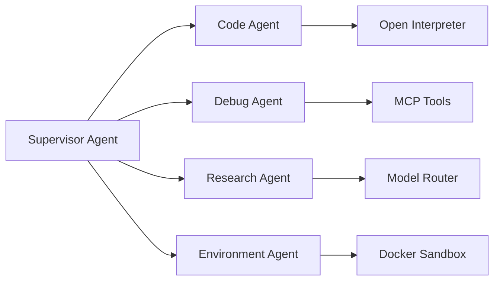

# Scaling Strategy
#scaling #plugins #multi-agent #remote-execution

## Purpose
Describe how JARVIS grows from a single local assistant into a multi-agent, plugin-driven platform.

## Scaling Axes
### 1. Capability scaling
- Add new MCP servers without changing the core agent loop
- Add interpreter profiles for domain-specific runtimes such as Python, Node, or containerized CLI stacks

### 2. Execution scaling
- Support multiple concurrent sessions
- Separate planning turns from execution turns
- Queue long-running tasks and stream updates back to the desktop UI

### 3. Agent scaling
- Introduce specialized sub-agents:
  - code agent
  - debugging agent
  - research agent
  - environment repair agent
- Use a supervisor pattern inside the agent layer rather than exposing multiple raw models to the UI

### 4. Deployment scaling
- Start local-first
- Add optional remote execution workers for heavy jobs
- Preserve the same plan/result protocol whether execution happens locally or remotely

## Multi-Agent Coordination Model

## Risks
- Cross-agent prompt drift
- More complicated approval semantics
- Harder traceability unless each sub-agent emits structured events

## Interaction Points
- Runtime foundation: [[Agent_Runtime]]
- Tool foundation: [[Tool_Registry_Design]]
- Sandbox foundation: [[Docker_Isolation_Strategy]]
- Security impact: [[Security_Model]]
