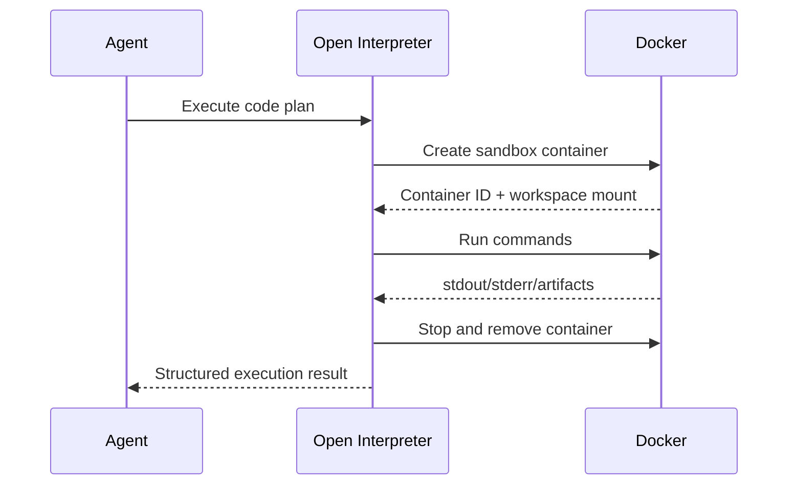

# Docker Isolation Strategy
#docker #security #sandbox #execution

## Purpose
Define how Docker isolates generated code, build tasks, and untrusted execution flows.

## Isolation Goals
- Prevent generated code from writing outside the allowed workspace
- Restrict network by default
- Avoid privileged containers
- Keep host secrets, SSH keys, and system paths out of the sandbox

## Why Docker
Open Interpreter safe mode is not a full security boundary. Docker provides process isolation via namespaces, cgroups, Linux capabilities, and optional seccomp profiles according to Docker's security docs. [Docker engine security](https://docs.docker.com/engine/security/)

## Container Policy
- Run as non-root inside the container where practical
- Prefer rootless Docker on Linux hosts when supported
- Mount only a scoped workspace directory
- Use read-only root filesystem unless a task requires writes
- Deny host networking by default
- Apply default or stricter seccomp profiles

Docker's rootless mode reduces daemon and runtime privilege exposure by running both daemon and containers inside a user namespace. [Docker rootless docs](https://docs.docker.com/engine/security/rootless/)

Docker's seccomp profile should remain enabled, because Docker documents the default profile as a least-privilege allowlist that blocks sensitive syscalls. [Docker seccomp docs](https://docs.docker.com/engine/security/seccomp/)

## Sandbox Lifecycle

## Mount Policy
- Allow:
  - project workspace
  - ephemeral artifact directory
- Deny:
  - home directory root
  - SSH config
  - credential stores
  - browser profiles

## Interaction Points
- Runtime owner: [[Open_Interpreter_Runtime]]
- Security policy: [[Security_Model]]
- Approval rules: [[Permission_and_Approval_Model]]
- Scaling: [[Scaling_Strategy]]
