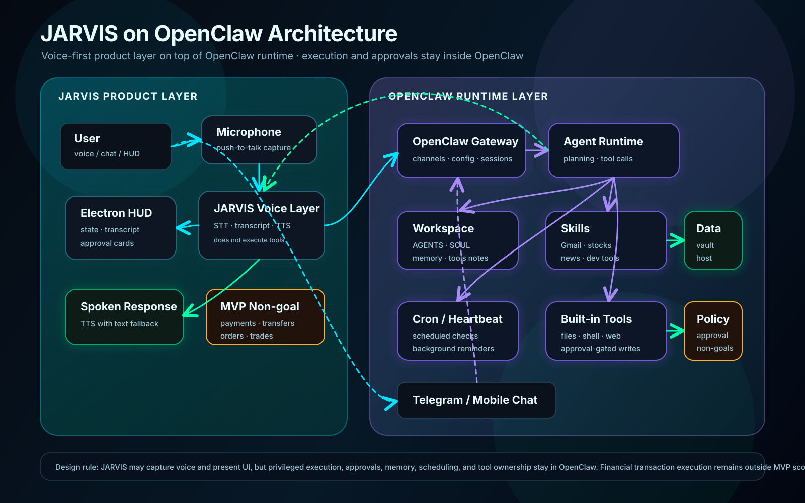

# OpenClaw Architecture Visual
#openclaw #figma #architecture #voice-layer #diagram

## Purpose
이 문서는 최신 JARVIS 아키텍처를 Figma에서 바로 다룰 수 있는 시각 자료로 정리한다.

핵심 방향은 **OpenClaw + JARVIS Voice Layer**다.

- JARVIS는 voice-first 제품 경험을 담당한다.
- OpenClaw는 실행, 승인, 세션, 도구, 메모리, 스케줄링을 담당한다.
- 결제/송금/주문/매매 같은 금융 거래 실행은 MVP 범위 밖이다.

## Figma Asset

SVG 파일:

```text
AI_Assistant_Knowledge_Base/OpenClaw/assets/jarvis-openclaw-architecture.svg
```

Figma 사용 방법:

1. Figma에서 새 Design file을 연다.
2. 위 SVG 파일을 canvas에 drag & drop 한다.
3. 필요하면 `Ungroup` 후 텍스트/박스/화살표를 편집한다.
4. 공유용 이미지는 Figma에서 PNG 또는 PDF로 export 한다.



## Visual Reading Guide

### 1. JARVIS Product Layer
왼쪽 cyan 영역이다.

담당 범위:
- microphone / push-to-talk 입력
- STT 처리
- transcript 표시
- Electron HUD
- TTS 응답
- approval card 표시
- JARVIS 브랜드와 voice-first UX

중요한 제한:
- 도구를 직접 실행하지 않는다.
- OpenClaw approval flow를 우회하지 않는다.
- 장기 메모리, cron, privileged local action을 소유하지 않는다.

### 2. OpenClaw Runtime Layer
오른쪽 purple 영역이다.

담당 범위:
- OpenClaw Gateway
- Agent Runtime
- session/context 관리
- workspace instruction 주입
- tools/skills 호출
- cron/heartbeat
- sub-agent/background task
- approval-gated write action

### 3. Data And Skills
OpenClaw Runtime 아래에서 JARVIS-specific 기능이 skills로 들어간다.

후보 skill:
- Gmail draft/triage
- stocks read-only briefing
- news summary
- developer project analysis
- Obsidian knowledge-base maintenance

### 4. Voice Loop
주요 흐름:

```text
User voice
→ Microphone / Push-to-talk
→ JARVIS Voice Layer
→ OpenClaw Gateway
→ OpenClaw Agent Runtime
→ tools / skills / workspace
→ response
→ JARVIS Voice Layer
→ Spoken Response + HUD transcript
```

### 5. Approval Safety
승인이 필요한 작업은 다음처럼 처리한다.

```text
OpenClaw detects approval-required action
→ HUD shows approval card
→ Voice Layer says the action is pending
→ user approves/rejects
→ OpenClaw executes or cancels
```

Voice Layer는 승인 전 작업을 완료된 것처럼 말하면 안 된다.

### 6. MVP Financial Non-goal
금융 정보 조회는 허용된다.

허용:
- 주식/시장 read-only briefing
- 가격/변동/뉴스 요약
- source-linked market summary

금지:
- 결제
- 송금/이체
- 청구서 납부
- 주식/코인/외환 주문
- 자동 매매
- 포트폴리오 리밸런싱
- 금융 의무를 발생시키는 모든 실행

## Design Notes For Figma

권장 frame 이름:

```text
JARVIS / OpenClaw Runtime Architecture
```

권장 export:

```text
jarvis-openclaw-architecture.png
jarvis-openclaw-architecture.pdf
```

색상 의미:

| Color | Meaning |
|---|---|
| Cyan | JARVIS-owned product/voice UX |
| Purple | OpenClaw-owned runtime/execution |
| Green | read-only output/data path |
| Amber | safety boundary / MVP non-goal |

## Related Documents
- [[OpenClaw_Runtime_Architecture]]
- [[OpenClaw_Migration_Plan]]
- [[OpenClaw_Workspace_Strategy]]
- [[Voice_Runtime_Design]]
- [[Voice_First_Minimal_UI]]
