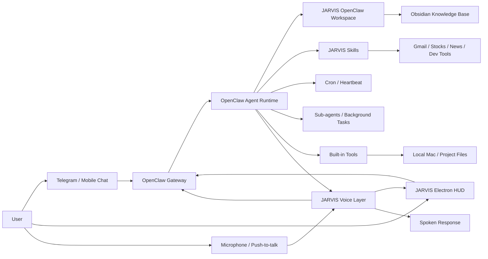

# OpenClaw Runtime Architecture
#openclaw #architecture #gateway #workspace #skills #desktop-ai

## Purpose
Define the target architecture for changing JARVIS into an OpenClaw-powered local desktop AI agent instead of a fully custom runtime.

## Target Architecture Summary
JARVIS becomes a voice-first product layer on top of OpenClaw, not a competing agent runtime.

OpenClaw owns the execution substrate: gateway, sessions, tools, approvals, scheduled work, workspace context, and sub-agents. JARVIS owns the product experience: wake/push-to-talk UX, speech pipeline, transcript display, persona, domain-specific skills, and opinionated safety defaults.

## Layer Responsibilities
### 1. OpenClaw Gateway
Owns runtime hosting, channel delivery, sessions, task scheduling, config, and tool wiring.

### 2. OpenClaw Agent Runtime
Owns planning, tool calls, session context, memory recall, workspace context injection, and sub-agent orchestration.

### 3. JARVIS Workspace
Stores JARVIS-specific operating instructions:
- `AGENTS.md` for behavior and execution rules
- `SOUL.md` for persona and tone
- `USER.md` for user preferences
- `TOOLS.md` for local tool notes
- `HEARTBEAT.md` for recurring checks
- `memory/` for daily and long-term continuity

### 4. JARVIS Skills
Package first-party domain capabilities as OpenClaw skills instead of hardcoding them into a custom FastAPI agent runtime.

Candidate skills:
- Gmail triage and draft creation
- Korean market stock briefings
- developer project analysis
- Obsidian knowledge-base maintenance
- voice/HUD commands

### 5. JARVIS Voice Layer
The Voice Layer is the main JARVIS-owned product surface above OpenClaw.

Responsibilities:
- capture microphone input through push-to-talk or explicit recording controls
- run STT and normalize transcripts before sending them to OpenClaw
- stream or display partial transcript state in the HUD
- send user turns to OpenClaw Gateway as normal agent messages
- receive final assistant output and convert the conversational part to TTS
- surface approval-required actions visually instead of speaking them as already-done work
- preserve a text fallback when STT/TTS fails

Non-responsibilities:
- it must not execute tools directly
- it must not bypass OpenClaw approval flows
- it must not own long-term memory, cron, channel routing, or privileged local actions

### 6. Electron Desktop HUD
The desktop app should become a local UI client for OpenClaw rather than the owner of privileged actions.

It should show:
- current agent state
- last transcript
- model/provider route
- tool activity
- approval cards
- background task status

## What Changes From The Current JARVIS Architecture
| Current custom component | OpenClaw-based replacement |
|---|---|
| custom Agent Runtime | OpenClaw agent runtime + workspace instructions |
| custom session persistence | OpenClaw session store |
| custom cron/automation | OpenClaw cron + heartbeat |
| custom channel layer | OpenClaw Telegram/other channels |
| custom tool registry | OpenClaw tools + skills |
| custom memory layer | OpenClaw memory + workspace files |
| FastAPI as central orchestrator | OpenClaw Gateway as central orchestrator |

## Components To Keep
- Electron/React voice-first HUD
- JARVIS Voice Layer for STT/TTS, transcript handling, and spoken UX
- Obsidian knowledge base
- product-specific workflows
- local model preferences
- safety policy and approval UX concepts
- JARVIS branding/persona

## Components To Reconsider
- FastAPI endpoints that duplicate OpenClaw Gateway
- custom model router if OpenClaw provider config covers the use case
- Open Interpreter as mandatory runtime
- separate custom MCP registry before OpenClaw skills are evaluated

## Open Questions
- Should the Electron HUD talk directly to OpenClaw Gateway APIs or use a thin JARVIS adapter?
- Which JARVIS tools should become OpenClaw skills first?
- How much of the existing FastAPI code should be archived versus retained?
- Should the Obsidian vault remain inside the repo or become the OpenClaw workspace itself?

## Related Documents
- [[ADR_004_OpenClaw_Runtime_Adoption]]
- [[OpenClaw_Migration_Plan]]
- [[OpenClaw_Workspace_Strategy]]
- [[Desktop_UI_Spec]]
- [[Voice_First_Minimal_UI]]
- [[Voice_Runtime_Design]]
