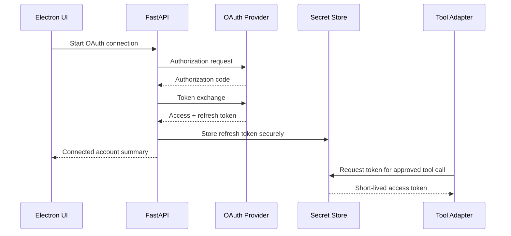

# OAuth and Secrets Model
#security #oauth #secrets #tokens

## Purpose
Define how JARVIS handles OAuth connections, API keys, refresh tokens, and other secrets for local and external tools.

## Principle
Secrets are configuration and authorization material, not memory. They must never be sent to models, stored in long-term memory, or displayed in normal tool output.

## Secret Classes
| Class | Examples | Storage |
|---|---|---|
| OAuth refresh token | Gmail, Calendar | OS-protected secret store or encrypted local vault |
| OAuth access token | Short-lived API access | In-memory cache with expiry |
| API key | News, stock, model provider | `.env` for dev, secret store for packaged app |
| User credential | Passwords, SSH keys | Never store or read directly |
| Session credential | Temporary auth challenge | Memory only, expire quickly |

## OAuth Scope Policy
| Integration | MVP Scope |
|---|---|
| Gmail drafts | Create/read drafts only if possible |
| Gmail send | Separate explicit approval before enabling send |
| Calendar | Read events before write scopes |
| GitHub | Read-only first, write scopes only per workspace |
| Cloud storage | Exclude from MVP unless required |

## Token Handling Flow

## Redaction Rules
- Redact tokens, API keys, cookies, authorization headers, and private keys from logs.
- Redact email body content before storing long-term audit summaries unless the user opts in.
- Redact selected local file content before cloud escalation unless policy explicitly permits it.
- Never include secret values in model prompts.

## Approval Rules
| Operation | Approval |
|---|---|
| Connect account | Required |
| Increase OAuth scopes | Required |
| Create draft | Required for MVP |
| Send email | Always required |
| Revoke integration | Confirm user intent |

## MVP Implementation
- Use `.env` only for developer-owned provider keys.
- Use a local encrypted token file or OS credential store for OAuth refresh tokens.
- Store only account display metadata in the database.
- Add a "Disconnect" action for every integration.

## Interaction Points
- Permission model: [[Permission_and_Approval_Model]]
- Tool schemas: [[First_Party_Tool_Schemas]]
- Memory privacy: [[Memory_and_Privacy_Model]]
- API contracts: [[API_and_Tool_Contracts]]
