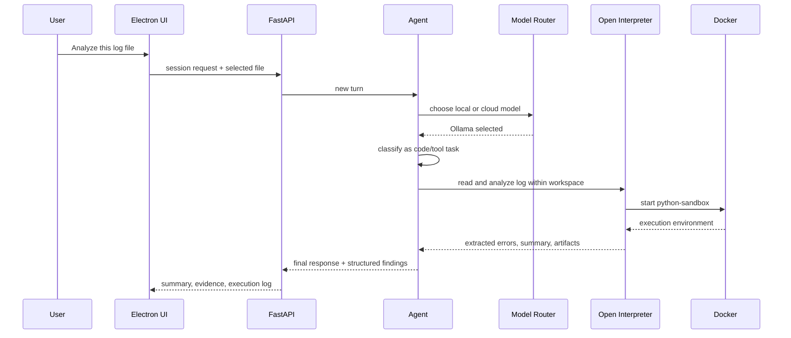
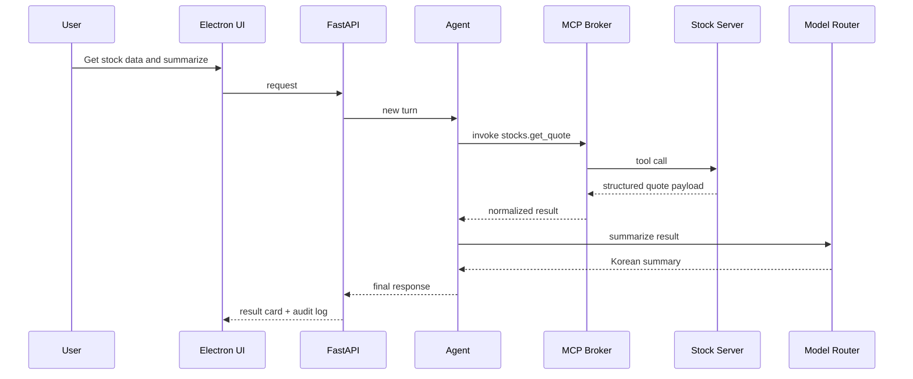
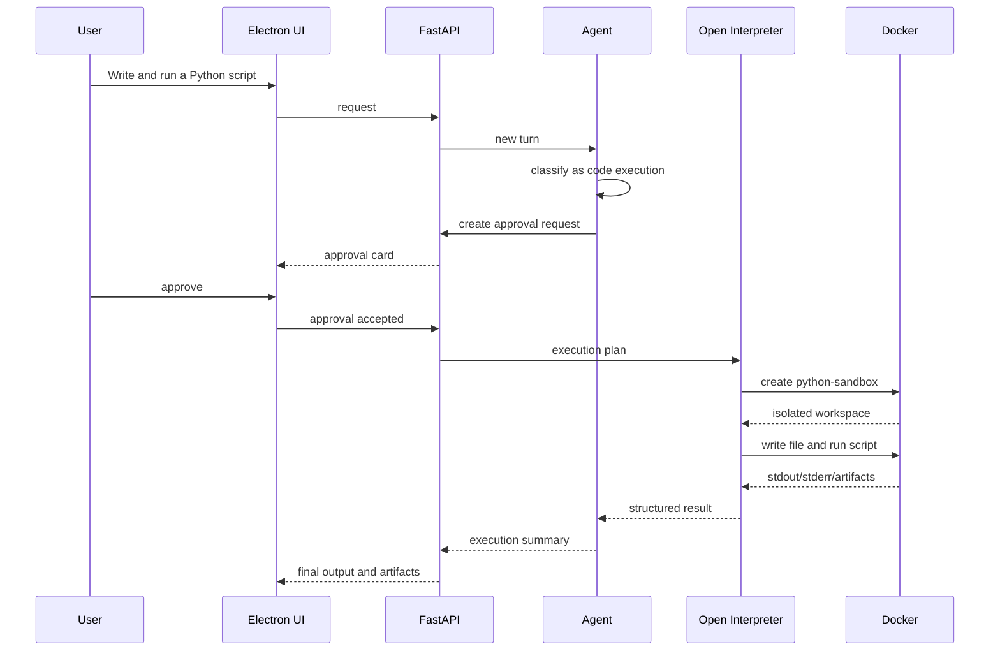

# Execution Flows
#workflows #agent #execution #mcp #interpreter

## Purpose
Capture the step-by-step execution logic for representative JARVIS tasks.

## Case A: Local Task
User request: "Analyze this log file"

### Notes
- Default route should remain local because log data is sensitive
- The interpreter can use Python parsing libraries inside the sandbox
- Approval may be skipped for read-only analysis

## Case B: External Tool via MCP
User request: "Get stock data and summarize"

### Notes
- The model does not scrape stock data itself
- MCP tool result is the source of truth
- Summarization can remain local if quality is acceptable

## Case C: Code Execution
User request: "Write and run a Python script"

## Interaction Points
- Architecture: [[Platform_Architecture]]
- Agent logic: [[Agent_Runtime]]
- Tool model: [[Tool_Invocation_Model]]
- Sandbox: [[Docker_Isolation_Strategy]]
